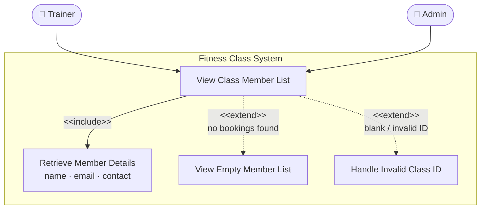

# Students Records API

This repo provides a template for setting up a flask rest API server. As a starting point, it shows an example of a simple hello world endpoint as well as endpoints that offer interactions with student records.

## Prerequisites

- python 3.10 or higher
- MongoDB installed. Follow [https://www.mongodb.com/docs/manual/installation/](https://www.mongodb.com/docs/manual/installation/)
to install MongoDB locally. Select the right link for your operating system.

## Tech Stack

This flask web app uses:

- [Flask-RESTX][flask-restx] for creating REST APIs. Directory structure
follows [flask restx instructions on scaling your project][flask-restx-scaling]
  - flask-restx automatically generates
  [OpenAPI specifications][openapi-specification] for your API
- [PyMongo][pymongo] for communicating with the mongodb database
- [pytest][pytest] for testing
(see [flask specific testing instructions on pytest][pytest-flask]
for more info specific to testing Flask applications)
- [mongomock][mongomock] for mocking the mongodb during unit testing

[flask-restx]: https://flask-restx.readthedocs.io/en/latest/quickstart.html
[flask-restx-scaling]: https://flask-restx.readthedocs.io/en/latest/scaling.html
[openapi-specification]: https://swagger.io/docs/specification/v3_0/about/
[pymongo]: https://pymongo.readthedocs.io/en/stable/
[pytest]: https://docs.pytest.org/en/stable/
[pytest-flask]: https://flask.palletsprojects.com/en/stable/testing/
[mongomock]: https://docs.mongoengine.org/guide/mongomock.html

## Running Locally

This assumes you are already running MongoDB (e.g., through
`brew services restart mongodb-community` on MacOS or
`sudo systemctl restart mongod` on Linux.
Find the equivalent for your OS)

### Setting up the environment

1. Check `.samplenv` file and follow the instructions there to create
your `.env` file
2. Run `make dev_env` to create a virtual environment and install dependencies

### Running the server

1. Run `make run_local_server` to run the server. This will also run the tests first.
2. Go to [http://127.0.0.1:8000](http://127.0.0.1:8000) to see it running!

You can use `ctrl-c` to stop the server.

### Testing the API server

Run `make tests` to execute the test suite and see the coverage report
in your terminal. You can also see a visual report by viewing
[/htmlcov/index.html](/htmlcov/index.html) in your browser.

### Manually activating and deactivating the virtual environment

Manually activating and deactivating the virtual environment is useful for
debugging issues and running specific scripts with flexibility (e.g., you can
run `FLASK_APP=app flask run --debug --host=0.0.0.0 --port 8000`
inside the virtual environment to directly start
the server without running tests first).

To activate the virtual environment manually:

```sh
source .venv/bin/activate
```

Alternatively, you can use:

```sh
. .venv/bin/activate
```

To deactivate the virtual environment:

```sh
deactivate
```

## Best Practices

See [/docs/BestPractices.md](/docs/BestPractices.md) for advice regarding branch naming and other useful tips.

---

## Feature 4: View Member/Guest List of a Class

**User story:** As a class trainer or center admin, I want to view who booked a spot in my class.

### Use Case Diagram



**Actors**
- **Trainer** — the instructor who created the class; views their own class roster.
- **Admin** — center administrator; can view the roster for any class.

---

### Use Case Specifications

#### UC1 — View Class Member List

| | |
|---|---|
| **Use case name** | View Class Member List |
| **Primary actors** | Trainer, Admin |

**Preconditions**
1. The user is authenticated as a Trainer or Admin.
2. At least one class has been created in the system (Feature 1).
3. The Trainer/Admin knows the class ID they want to inspect.

**Main success scenario**
1. The Trainer/Admin provides the class ID for the class they want to inspect.
2. The system validates that the class ID is a non-blank string.
3. The system queries the bookings collection for all records matching that class ID.
4. The system retrieves each booked member's name, email address, and contact number.
5. The system returns the complete member list to the Trainer/Admin.
6. The Trainer/Admin reviews the member information on the dashboard.

**Alternative flows / Extensions**

- **2a. Class ID is blank or whitespace**
  1. The system rejects the request before querying the database.
  2. Returns HTTP 406 — `"Invalid class ID provided"`.
  3. Use case ends.

- **3a. No members have booked the class**
  1. The system finds no matching booking records.
  2. Returns HTTP 200 with an empty list `[]`.
  3. Dashboard displays *"No members have booked this class yet."*
  4. Use case ends successfully (empty class is a valid state).

- **5a. Unexpected system / database error**
  1. The system catches the error.
  2. Returns HTTP 500 with a descriptive error message.
  3. The Trainer/Admin is informed the request could not be completed.
  4. Use case ends.

**Success guarantee / Postconditions**
1. The Trainer/Admin has viewed the name, email, and contact of every booked member.
2. No data is modified — this is a read-only operation.
3. All booking and class records remain unchanged.

---

#### UC2 — Retrieve Member Details *(included by UC1)*

| | |
|---|---|
| **Use case name** | Retrieve Member Details |

**Preconditions**
1. UC1 has been triggered and a valid class ID was provided.
2. At least one booking record exists for the class.

**Main success scenario**
1. The system fetches all booking documents where `class_id` matches.
2. For each booking, the system extracts `user_name`, `user_email`, and `user_contact`.
3. The system serialises the records and returns them to UC1 for display.

**Alternative flows / Extensions**
- None beyond those already handled by UC1.

**Success guarantee / Postconditions**
1. A list of member detail objects (name, email, contact) is returned to UC1.

---

#### UC3 — View Empty Member List *(extends UC1)*

| | |
|---|---|
| **Use case name** | View Empty Member List |
| **Extension point** | After step 3 of UC1 — when zero bookings are found |

**Preconditions**
1. UC1 was triggered with a valid, non-blank class ID.
2. No bookings exist for the specified class.

**Main success scenario**
1. The system queries the bookings collection and finds zero records.
2. Returns HTTP 200 with an empty list `[]`.
3. The Trainer/Admin sees a *"no members yet"* message on the dashboard.

**Alternative flows / Extensions**
- None.

**Success guarantee / Postconditions**
1. The Trainer/Admin is clearly informed that nobody has booked the class.
2. No error is raised — an empty class is a valid, expected state.

---

#### UC4 — Handle Invalid Class ID *(extends UC1)*

| | |
|---|---|
| **Use case name** | Handle Invalid Class ID |
| **Extension point** | After step 2 of UC1 — when the class ID is blank or whitespace |

**Preconditions**
1. UC1 was triggered.
2. The class ID provided is blank or consists only of whitespace.

**Main success scenario**
1. The system detects the invalid class ID before touching the database.
2. Returns HTTP 406 — `"Invalid class ID provided"`.
3. No database query is made.

**Alternative flows / Extensions**
- None.

**Success guarantee / Postconditions**
1. The Trainer/Admin receives a clear error message explaining the issue.
2. The database is not queried unnecessarily.
