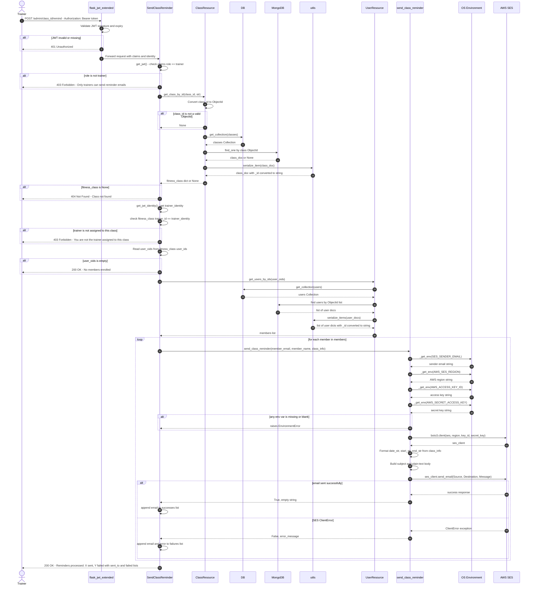
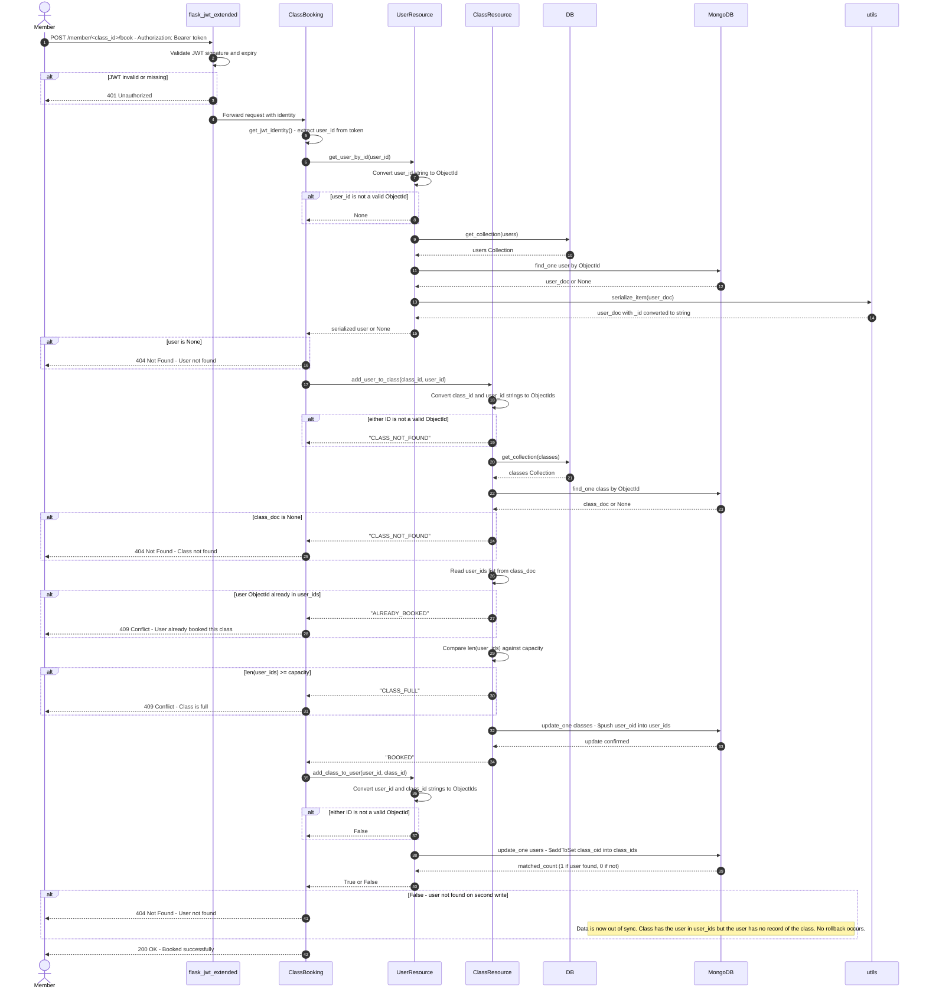
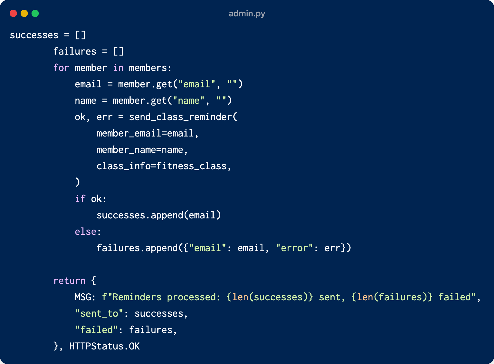
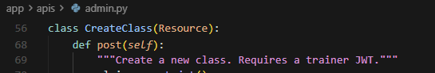
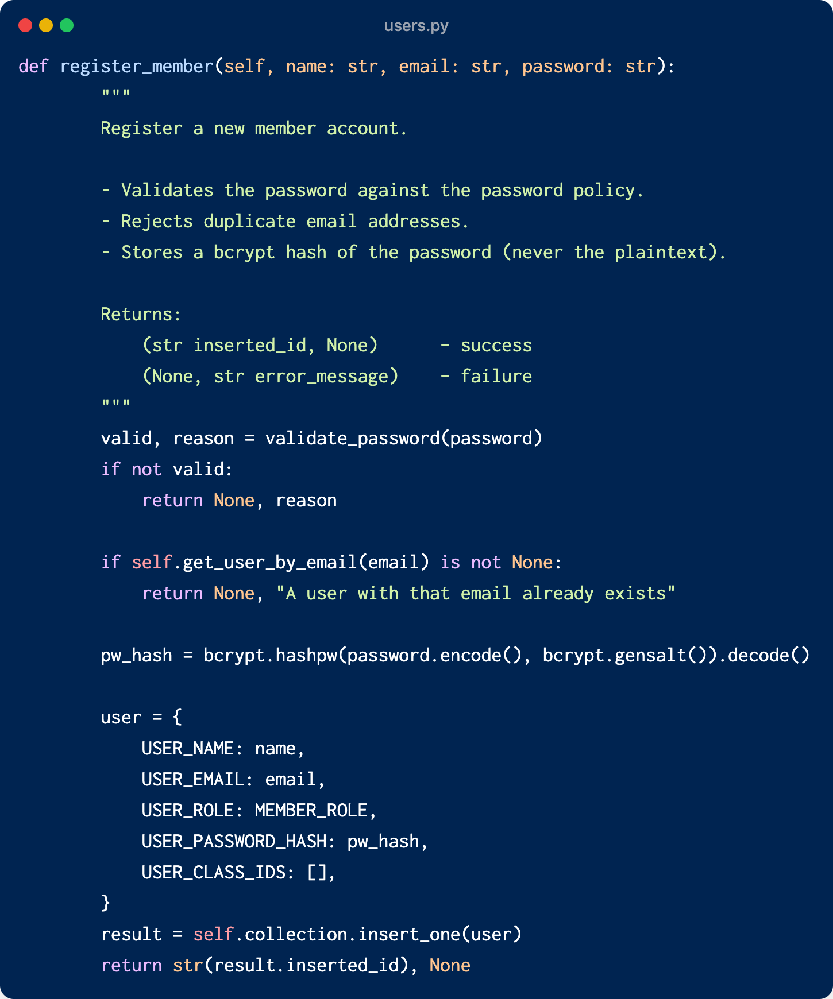
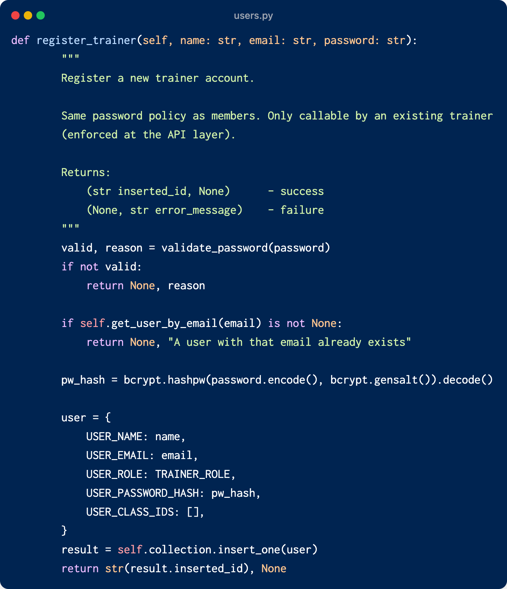
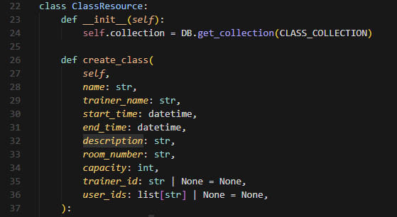
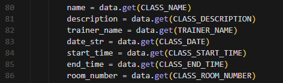
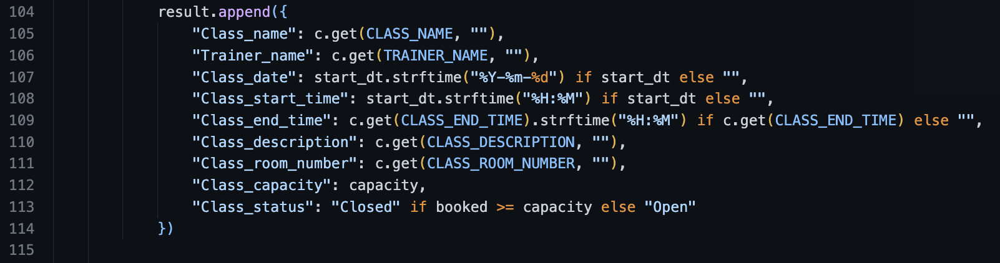
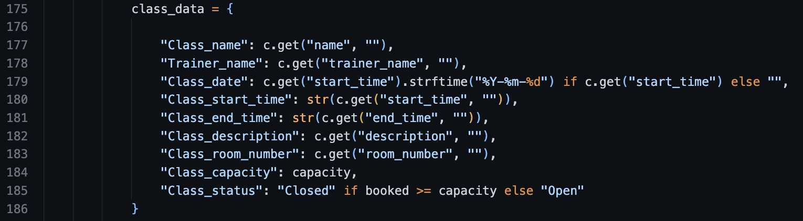

# Design Reflection

## Executive Summary:

To complete task 1 diagrams, we have utilized pyreverse to get the starting diagrams. 

We have maullay analyzed the code to figure out the existence of design violations and code smells. With reference to the slides, for what each violation means, we have been able to identify and icnlude theri screenshots as required.

# Team member responsibilities

Raissa: 
- Created the class diagram to show mian classes and their associations
- Added a design principle violation for task 2 
- Added a code smell found in tests for task 3
- Added reflection for the new features with reference to existing code design
### Tools Used:

Visual Studio PyreverseSequence Plugin was used to make an initial sequence diagram for the send class reminder endpoint. This was then edited to incorporate missing lifelines and actors.

Uditi:
- Added design principle violations in task 2 from Feature 4 implementation and tests
- Added code smells found in Feature 4 tests and implementation for task 3
- Added reflection points for task 4 based on findings in Feature 4 code

## Task 1:

### Class Diagram - Show main classes and their associations

# Using mermaid "
classDiagram
    direction TB
    
    %% Actors 
    class Trainer {
        <<actor>>
        +create_recurring_class()
        +send_reminder()
    }

    class Member {
        <<actor>>
        +view_class_list()
        +view_enrolled_classes()
        +book_class()
    }

    %% Flask_restx base
    class Resource {
        <<abstract>>
        +get()
        +post()
        +put()
        +delete()
    }

    %% API RESOURCES (app/apis/)
    class ClassList {
        +get() List~Class~
    }

    class EnrolledClasses {
        +get() List~Class~
    }

    class ClassBooking {
        +post(class_id) Response
    }

    class CreateClass {
        +post() Response
    }

    class ClassMemberList {
        +get(class_id) List~Member~
    }

    class SendClassReminder {
        +post(class_id) Response
    }

    class MemberLogin {
        +post() Token
    }

    class MemberRegister {
        +post() Response
    }

    class TrainerLogin {
        +post() Token
    }

    class TrainerRegister {
        +post() Response
    }

    %% DATABASE CLASSES (app/db/)
    class DB {
        -_db: MongoClient
        -_instance: DB
        +get_instance() DB
        +get_collection(name) Collection
        -_get() Connection
    }

    class ClassResource {
        +get_class_by_id(class_id) Class
        +add_user_to_class(class_id, user_id) str
        +create_class(class_data) Response
        +update_class(class_id, data) Response
        +delete_class(class_id) Response
    }

    class UserResource {
        +get_user_by_id(user_id) User
        +get_users_by_ids(user_ids) List~User~
        +add_class_to_user(user_id, class_id) bool
        +create_user(user_data) Response
        +update_user(user_id, data) Response
    }

    %% DATA ENTITIES
    class User {
        -user_id: ObjectId
        -name: str
        -email: str
        -password_hash: str
        -role: str
        -enrolled_class_ids: List~ObjectId~
        +to_dict() dict
    }

    class Class {
        -class_id: ObjectId
        -name: str
        -trainer_name: str
        -trainer_id: ObjectId
        -start_time: datetime
        -end_time: datetime
        -description: str
        -room_number: str
        -capacity: int
        -user_ids: List~ObjectId~
        +is_full() bool
        +get_status() str
        +to_dict() dict
    }

    class Enrollment {
        <<association>>
        -booking_date: datetime
        -status: str
        +confirm() void
        +cancel() void
    }

    class Config {
        -MONGO_URI: str
        -JWT_SECRET_KEY: str
        -AWS_SES_REGION: str
        -AWS_ACCESS_KEY_ID: str
        -AWS_SECRET_ACCESS_KEY: str
        +from_env() Config
    }

    %% INHERITANCE RELATIONSHIPS 
    Resource <|-- ClassList : inherits
    Resource <|-- EnrolledClasses : inherits
    Resource <|-- ClassBooking : inherits
    Resource <|-- CreateClass : inherits
    Resource <|-- ClassMemberList : inherits
    Resource <|-- SendClassReminder : inherits
    Resource <|-- MemberLogin : inherits
    Resource <|-- MemberRegister : inherits
    Resource <|-- TrainerLogin : inherits
    Resource <|-- TrainerRegister : inherits

    %% DEPENDENCY RELATIONSHIPS(uses)
    ClassList ..> DB : uses
    EnrolledClasses ..> DB : uses
    ClassBooking ..> UserResource : uses
    ClassBooking ..> ClassResource : uses
    CreateClass ..> ClassResource : uses
    ClassMemberList ..> ClassResource : uses
    SendClassReminder ..> ClassResource : uses
    SendClassReminder ..> UserResource : uses
    ClassResource ..> DB : uses
    UserResource ..> DB : uses
    DB ..> Config : uses

    %% ASSOCIATION RELATIONSHIPS 
    ClassResource --> Class : manages
    UserResource --> User : manages
    
    User "1..*" -- "1..*" Class : books >
    Enrollment -- User : records for
    Enrollment -- Class : records for

    %% ACTOR TO RESOURCE RELATIONSHIPS
    Member --> ClassList : views
    Member --> EnrolledClasses : views
    Member --> ClassBooking : books
    Trainer --> CreateClass : creates
    Trainer --> SendClassReminder : sends

### Sequence Diagram — Send Class Reminder Endpoint

### Sequence Diagram - Book A Class Endpoint 

---

## Task 2: Design Principle Violations

### Violation 1 — Open/Closed Principle (OCP)

**Principle:** Software entities should be open for extension but closed for modification.

**Location:**

- `app/email.py`, `send_class_reminder()`, lines 16–83
  
- `app/apis/admin.py`, `SendClassReminder.post()`, line 21 (import) and lines 263–267 (call site)
  

**Explanation:**
The entire notification pipeline is hardwired to a single delivery mechanism: AWS SES email. There is no abstraction or extension point. If Feature 7 (Configure Notifications) requires adding SMS or Telegram, a developer would have to:

- Modify `send_class_reminder()` or write a parallel function
- Modify `SendClassReminder.post()` to conditionally call the right channel

This is a direct violation of OCP. A well-designed system would define a `NotificationService` abstraction (e.g., a protocol or abstract base class with a `send()` method), with `SESEmailNotifier` as one concrete implementation. The `SendClassReminder` handler would depend on the abstraction and new channels could be added without touching existing code. 

### Violation 2 - Abstraction principle

**Principle:** The design of a class makes clients understand what it does and how to use it without caring about details

**Location:** 
- `app/member.py`, `EnrolledClasses.get()`, lines 129-162 and 166-190 (screenshoot attached in violation2_1 and violation 2_2)

**Explanation:**
This code violates the principle of abstraction becaus ethe client needs to know to much of the internal details of the class to be ablle to get a list of enrolled classes. Nmaely:
- Database collection names such as MongoDB, collection is "classes",...
- MongoDB query syntax
- Exact field names inside documents like "user_ids", "start_time",...
- How to calculate class status

All of this shows violation of abstraction because a good system design would allow the client to remain unaffected if and when the repository class changes for instance when we need to add a new feature that might affect the database. 

A well designed system would have `classes_collection` abstract that accesses the database on its own and finds the list of required classes, and a `status` abstract to calculate the status of a class. The only information the client would need is to call these abstract classes and get results.

---

### Violation 2 - Modularity

**Principle:** 1. High cohesion - Modules should contain functions that logically belong together with the attributes they use; 2. Low/weak coupling – Changes to modules should not affect other modules

**Location:**

- `app/admin.py`, `class CreateClass(Resource)`

  

**Explanation:**
The endpoint also performs authentication and input validation

- Authentication: Line 70-72
- Input validation: Line 80-126

This violation is also repeated in other endpoints such as SendClassReminder, ClassMemberList

### Violation 3 - Single Responsibility Principle (SRP) 
**Principle:** A class or function should have only one reason to change.

**Location:** 
- `app/apis/member.py` , method `ClassBooking.post()`, lines 229-252 
 

**Explanation:**
The ClassBooking.post() method violates SRP by combing multiple responsibilities into a single function: 

1. User lookup (lines 231–236) — retrieves the current user using get_jwt_identity() and validates existence
2. Class booking logic (lines 238–246) — calls add_user_to_class() and handles different booking outcomes (class full, already booked, etc.)
3. User update logic (lines 248–250) — updates the user’s enrolled classes via add_class_to_user()

Each of these represents a separate reason for change. For example, modifying booking rules, changing how users are retrieved, or altering how enrollments are stored would all require edits to this same method. This tightly coupled design reduces modularity and makes the function harder to maintain and extend.

---

### Violation 4 - Open/Closed Principle (OCP)

**Principle:** Software entities should be open for extension but closed for modification.

**Location:**
- `app/apis/admin.py`, `ClassMemberList.get()`, line 166

**Explanation:**
The role check uses a hardcoded list: `if role not in ("trainer", "admin")`. If a new role such as "manager" needs access to this endpoint in the future, a developer must open this file and edit this exact line. A better design would store allowed roles in a configuration or use a decorator, so new roles could be added without modifying the method body at all. This pattern is also repeated across other endpoints in the same file, meaning each one would need to be edited individually.

---

### Violation 5 - Modularity Principle

**Principle:** High cohesion and low coupling. Modules should be broken into reusable, independent pieces, and changes to one module should not force changes in others.

**Location:**
- `tests/unit/test_admin.py`, lines 49, 81, 103, 138

**Explanation:**
The same mock setup for `ClassResource` is copied identically into four different test functions. Instead of writing a shared helper or pytest fixture for this repeated setup, the block is duplicated four times across the file. If the import path of `ClassResource` changes, every one of these four lines must be updated manually. A shared pytest fixture would centralize this setup, making the tests more modular and easier to maintain when the production code changes.

---

## Task 3: Code Smells

### Code Smell 1 — Duplicate Code

**Location:** `app/db/users.py`, `register_member()` lines 140–169:

`register_trainer()` lines 200–228

**Explanation:**
The body of both methods is virtually identical line-for-line. This is a classic **Duplicate Code** smell. The duplicated block spans password validation, email uniqueness checking, password hashing, document construction, and database insertion. The shared logic should be extracted into a single private helper method parameterised by role, eliminating the duplication and making future changes to registration logic require a single edit.

---

### Code Smell 2 - Long Parameter List

**Location:** `app/db/classes.py`, `ClassResource`, `create_class()`, line 38

**Explanation:**
create_class method has a long parameter list with 8 parameters

---

### Code smell 3 - Primitive Obsession

**Location:** `app/apis/admin.py`, `class CreateClass(Resource)`, line 80-86

**Explanation:** class data is handled as many raw primitives (name, date_str, start_time, capacity, etc.) instead of a single typed request object, which makes validation and data flow scattered and error-prone.
### Code Smell 2 - Long Method 
Many lines of code in a method making it hard to understand.

**Location:** 
- `tests/unit/test_view_classlist.py`, `test_complete_workflow` lines 268-314
(Screenshoot attached in code_smell2)

**Explanation:**
This method is too long because it goes over 30+ lines of code. Since this is a test for overall workflow of the get class list method, it tests multiple things simultaneously. For instance it does:
- Setting up mocks for database
- Testing the "get all classes" endpoint
- Testing the "get enrolled classes" endpoint

A client needs to understand the flow of the code and previous tests to know what is being tested, how and when. This makes the code hard to understand and maintain, hence, the code smell. To make the process simpler, the code should be extracted and broken down into smaller focused test methods.

### Code Smell 4 — Duplicate Code

**Location:** `app/apis/member.py`
`ClassList.get()`, lines 104-114 , `EnrolledClasses.get()`, lines 175-186

 

 

**Explanation:**
Both ClassList.get() and EnrolledClasses.get() construct nearly identical dictionary structures with the same keys (e.g., class_name, trainer_name, etc..). This is a clear case of Duplicate Code.A better approach would be to extract this shared logic into a helper function (format_class_response(c, capacity, booked)) and reuse it across both methods.

---

### Code Smell 5 - Magic Strings

**Location:** `tests/unit/test_admin.py`, lines 60, 86, 121, 143

**Explanation:**
The URL string `"/admin/class-1/members"` and the class ID `"class-1"` are hardcoded identically across four different test functions. If the URL structure changes, every one of those lines must be updated manually. Defining these as a named constant at the top of the file would mean a single change covers all four tests.

---

### Code Smell 6 - Long Method

**Location:** `app/apis/admin.py`, `ClassMemberList.get()`, lines 160-194

**Explanation:**
The method is 34 lines long and performs five distinct jobs: checking the requester's role, looking up the class by ID, extracting the list of user IDs, fetching full user details, and formatting the response. This is a Long Method smell. Each of these steps could be extracted into a smaller, named helper so that each piece is easier to read, test, and change on its own. As it stands, any change to role checking, data fetching, or response formatting all touch the same method.

---

## Task 4: Reflection on New Features

### Feature 6 - Create Recurring Class

- _Primitive Obsession_ and _Long Parameter List_ in Code smell 2,3 will hinder the implementation of feature 6. Create recurring class means adding another attribute to class to manage recurring time. Based on the current implementation, we will have to implement extra validation for this new field and also add another parameter in create_class() method.

- The OCP violation in `ClassMemberList.get()` (Violation 4) means that if Feature 6 introduces a new role type, such as a dedicated recurring class manager, access control would require direct edits to multiple endpoint methods rather than a single config change. This makes expanding role-based access risky and error-prone.

- `ClassMemberList.get()` already performs five distinct jobs in 34 lines (Smell 6). Adding recurring class support, such as filtering or grouping the member list by recurrence, would extend this method further and make the Long Method smell significantly worse.

### Feature 7 — Configure Notifications
- The current design will make the implementation difficult from both a maintainability and extensibility perspective. As identified in Task 3, class data formatting is duplicated across multiple endpoints, so adding recurrence-related fields would require changes in several places, increasing the risk of inconsistencies. Additionally, the SRP violation in Task 2 means ClassBooking.post() already combines multiple responsibilities, and extending it to support recurring bookings would further increase its complexity. Overall, the lack of separation of concerns and duplicated logic makes the system harder to scale without refactoring.

- This feature will need us to add recurrence fields which will require to modify every API endpoint that works with class data. The current design we have has abstraction issues which will make the extensibility and maintainability of the code difficult. Since API already knows field names, adding a new feature will need complete modification of these endpoints to include these fields. This will increase the risk of making errors that lead to more violations. 

- The current design already has code smells such as long method. With the addition of this new feature that will require definition of the recurrence_logic such as a `get_recurrence` will add more lines to the already existing code. If the design is not corretced, this new recurrence logic wold lead to more code smells making reading and formatting harder to understand. 
### Feature 7 — Configure Notifications 

- As violation 1 in task 2 says, the OCP violation in `app/email.py` and `app/apis/admin.py` mean there is no abstraction to extend: the reminder endpoint is hardwired to call one concrete function that delivers one type of notification via one provider. Adding a second channel (SMS, for example) means either bloating `SendClassReminder.post()` with conditional dispatch logic or duplicating the entire endpoint. A `NotificationService` protocol with channel-specific implementations would need to be designed from scratch, and the existing code restructured around it before Feature 7 can be implemented in a maintainable way.

- 