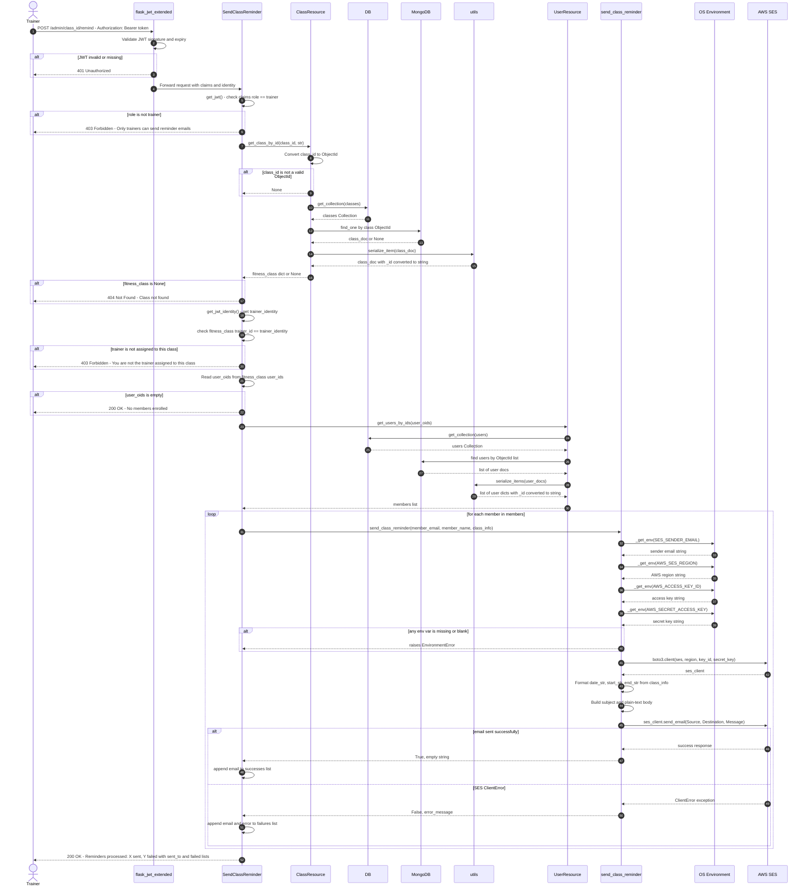

# Design Reflection

## Executive Summary:

### Tools Used:

Visual Studio PyreverseSequence Plugin was used to make an initial sequence diagram for the send class reminder endpoint. This was then edited to incorporate missing lifelines and actors.

## Task 1: 

### Class Diagram - Show main classes and their associations

# Using mermaid "
classDiagram
    direction TB
    
    %% Actors 
    class Trainer {
        <<actor>>
        +create_recurring_class()
        +send_reminder()
    }

    class Member {
        <<actor>>
        +view_class_list()
        +view_enrolled_classes()
        +book_class()
    }

    %% Flask_restx base
    class Resource {
        <<abstract>>
        +get()
        +post()
        +put()
        +delete()
    }

    %% API RESOURCES (app/apis/)
    class ClassList {
        +get() List~Class~
    }

    class EnrolledClasses {
        +get() List~Class~
    }

    class ClassBooking {
        +post(class_id) Response
    }

    class CreateClass {
        +post() Response
    }

    class ClassMemberList {
        +get(class_id) List~Member~
    }

    class SendClassReminder {
        +post(class_id) Response
    }

    class MemberLogin {
        +post() Token
    }

    class MemberRegister {
        +post() Response
    }

    class TrainerLogin {
        +post() Token
    }

    class TrainerRegister {
        +post() Response
    }

    %% DATABASE CLASSES (app/db/)
    class DB {
        -_db: MongoClient
        -_instance: DB
        +get_instance() DB
        +get_collection(name) Collection
        -_get() Connection
    }

    class ClassResource {
        +get_class_by_id(class_id) Class
        +add_user_to_class(class_id, user_id) str
        +create_class(class_data) Response
        +update_class(class_id, data) Response
        +delete_class(class_id) Response
    }

    class UserResource {
        +get_user_by_id(user_id) User
        +get_users_by_ids(user_ids) List~User~
        +add_class_to_user(user_id, class_id) bool
        +create_user(user_data) Response
        +update_user(user_id, data) Response
    }

    %% DATA ENTITIES
    class User {
        -user_id: ObjectId
        -name: str
        -email: str
        -password_hash: str
        -role: str
        -enrolled_class_ids: List~ObjectId~
        +to_dict() dict
    }

    class Class {
        -class_id: ObjectId
        -name: str
        -trainer_name: str
        -trainer_id: ObjectId
        -start_time: datetime
        -end_time: datetime
        -description: str
        -room_number: str
        -capacity: int
        -user_ids: List~ObjectId~
        +is_full() bool
        +get_status() str
        +to_dict() dict
    }

    class Enrollment {
        <<association>>
        -booking_date: datetime
        -status: str
        +confirm() void
        +cancel() void
    }

    class Config {
        -MONGO_URI: str
        -JWT_SECRET_KEY: str
        -AWS_SES_REGION: str
        -AWS_ACCESS_KEY_ID: str
        -AWS_SECRET_ACCESS_KEY: str
        +from_env() Config
    }

    %% INHERITANCE RELATIONSHIPS 
    Resource <|-- ClassList : inherits
    Resource <|-- EnrolledClasses : inherits
    Resource <|-- ClassBooking : inherits
    Resource <|-- CreateClass : inherits
    Resource <|-- ClassMemberList : inherits
    Resource <|-- SendClassReminder : inherits
    Resource <|-- MemberLogin : inherits
    Resource <|-- MemberRegister : inherits
    Resource <|-- TrainerLogin : inherits
    Resource <|-- TrainerRegister : inherits

    %% DEPENDENCY RELATIONSHIPS(uses)
    ClassList ..> DB : uses
    EnrolledClasses ..> DB : uses
    ClassBooking ..> UserResource : uses
    ClassBooking ..> ClassResource : uses
    CreateClass ..> ClassResource : uses
    ClassMemberList ..> ClassResource : uses
    SendClassReminder ..> ClassResource : uses
    SendClassReminder ..> UserResource : uses
    ClassResource ..> DB : uses
    UserResource ..> DB : uses
    DB ..> Config : uses

    %% ASSOCIATION RELATIONSHIPS 
    ClassResource --> Class : manages
    UserResource --> User : manages
    
    User "1..*" -- "1..*" Class : books >
    Enrollment -- User : records for
    Enrollment -- Class : records for

    %% ACTOR TO RESOURCE RELATIONSHIPS
    Member --> ClassList : views
    Member --> EnrolledClasses : views
    Member --> ClassBooking : books
    Trainer --> CreateClass : creates
    Trainer --> SendClassReminder : sends

### Sequence Diagram — Send Class Reminder Endpoint

---

## Task 2: Design Principle Violations

### Violation 1 — Single Responsibility Principle (SRP)

**Principle:** A class or function should have only one reason to change.

**Location:** `app/email.py`, function `send_class_reminder()`, lines 16–83

**Explanation:**
`send_class_reminder()` conflates four distinct responsibilities in one function:

1. **Configuration loading** (lines 33–36) — reads four environment variables via `_get_env()`
2. **Client construction** (lines 38–43) — instantiates the `boto3` SES client
3. **Content formatting** (lines 45–70) — parses datetime objects and builds the subject line and plain-text body
4. **Email delivery** (lines 72–83) — calls `ses_client.send_email()` and handles `ClientError`

Each of these is a separate reason for the function to change. For example, switching the email body to HTML, changing how credentials are sourced, or replacing SES with another provider would all require modifying this single function. A function with one responsibility should only change for one reason.

---

### Violation 2 — Open/Closed Principle (OCP)

**Principle:** Software entities should be open for extension but closed for modification.

**Location:**
- `app/email.py`, `send_class_reminder()`, lines 16–83 (Screenshot attached above in Violation 1)
- `app/apis/admin.py`, `SendClassReminder.post()`, line 21 (import) and lines 263–267 (call site)
    

**Explanation:**
The entire notification pipeline is hardwired to a single delivery mechanism — AWS SES email. There is no abstraction or extension point. If Feature 7 (Configure Notifications) requires adding SMS or Telegram, a developer would have to:

- Modify `send_class_reminder()` or write a parallel function
- Modify `SendClassReminder.post()` to conditionally call the right channel

This is a direct violation of OCP. A well-designed system would define a `NotificationService` abstraction (e.g., a protocol or abstract base class with a `send()` method), with `SESEmailNotifier` as one concrete implementation. The `SendClassReminder` handler would depend on the abstraction and new channels could be added without touching existing code.

### Violation 3 - Abstraction principle

**Principle:** The design of a class makes clients understand what it does and how to use it without caring about details

**Location:** 
- `app/member.py`, `EnrolledClasses.get()`, lines 129-162 and 166-190 (screenshoot attached in violation3_1 and violation 3_2)

**Explanation:**
This code violates the principle of abstraction becaus ethe client needs to know to much of the internal details of the class to be ablle to get a list of enrolled classes. Nmaely:
- Database collection names such as MongoDB, collection is "classes",...
- MongoDB query syntax
- Exact field names inside documents like "user_ids", "start_time",...
- How to calculate class status

All of this shows violation of abstraction because a good system design would allow the client to remain unaffected if and when the repository class changes for instance when we need to add a new feature that might affect the database. 

A well designed system would have `classes_collection` abstract that accesses the database on its own and finds the list of required classes, and a `status` abstract to calculate the status of a class. The only information the client would need is to call these abstract classes and get results.

---

## Task 3: Code Smells

### Code Smell 1 — Duplicate Code

**Location:** `app/db/users.py`, `register_member()` lines 140–169:

`register_trainer()` lines 200–228

**Explanation:**
The body of both methods is virtually identical line-for-line. This is a classic **Duplicate Code** smell. The duplicated block spans password validation, email uniqueness checking, password hashing, document construction, and database insertion. The shared logic should be extracted into a single private helper method parameterised by role, eliminating the duplication and making future changes to registration logic require a single edit.

### Code Smell 2 - Long Method 
Many lines of code in a method making it hard to understand.

**Location:** 
- `tests/unit/test_view_classlist.py`, `test_complete_workflow` lines 268-314
(Screenshoot attached in code_smell2)

**Explanation:**
This method is too long because it goes over 30+ lines of code. Since this is a test for overall workflow of the get class list method, it tests multiple things simultaneously. For instance it does:
- Setting up mocks for database
- Testing the "get all classes" endpoint
- Testing the "get enrolled classes" endpoint

A client needs to understand the flow of the code and previous tests to know what is being tested, how and when. This makes the code hard to understand and maintain, hence, the code smell. To make the process simpler, the code should be extracted and broken down into smaller focused test methods.

---

## Task 4: Reflection on New Features

**Feature 7 — Configure Notifications** is where the design violations identified in Tasks 2 and 3 directly compound into a real implementation problem. Three issues make this feature difficult to add cleanly. First, the user document schema in `app/db/users.py` has no field for notification preferences, meaning there is no way to store whether a member wants email, SMS, Telegram, or some combination. Adding this requires a schema change and corresponding updates to `UserResource`, `register_member`, and `register_trainer` (which are already duplicated). Second, the OCP violation in `app/email.py` and `app/apis/admin.py` mean there is no abstraction to extend: the reminder endpoint is hardwired to call one concrete function that delivers one type of notification via one provider. Adding a second channel (SMS, for example) means either bloating `SendClassReminder.post()` with conditional dispatch logic or duplicating the entire endpoint. Third, the SRP violation in `send_class_reminder()` means the email formatting and delivery logic are fused together, making it impossible to reuse just the formatting step for a different channel without copying code. A `NotificationService` protocol with channel-specific implementations would need to be designed from scratch, and the existing code restructured around it before Feature 7 can be implemented in a maintainable way.
