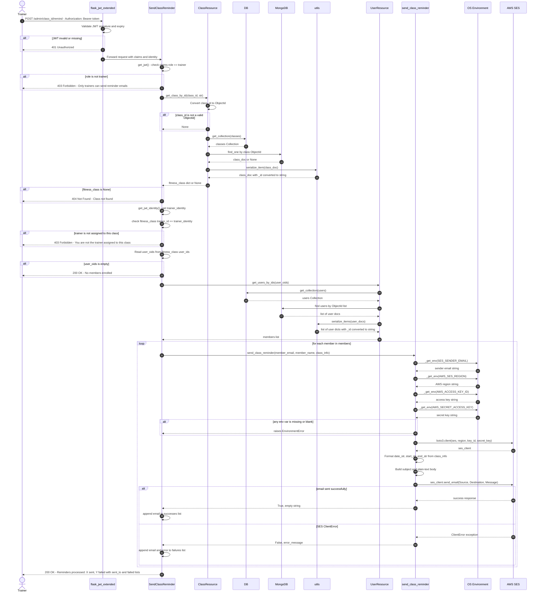
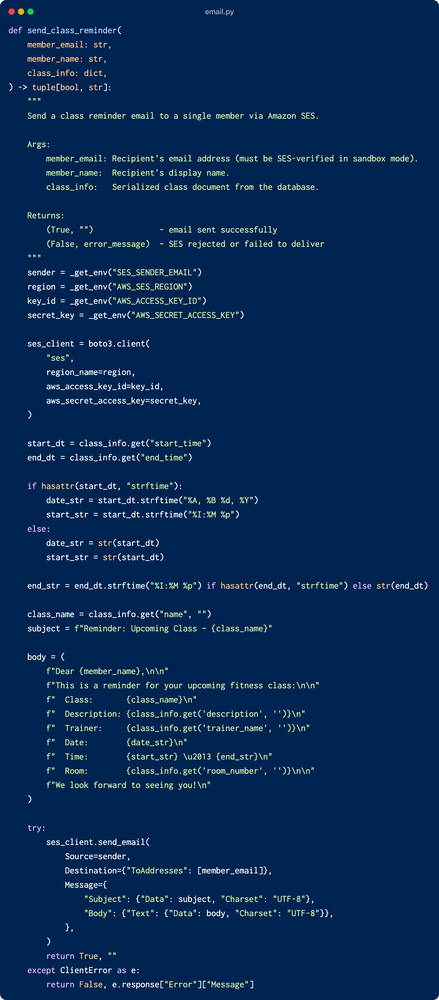

# Design Reflection

## Executive Summary:

### Tools Used:

Visual Studio PyreverseSequence Plugin was used to make an initial sequence diagram for the send class reminder endpoint. This was then edited to incorporate missing lifelines and actors.

## Task 1: 

### Sequence Diagram — Send Class Reminder Endpoint

---

## Task 2: Design Principle Violations

### Violation 1 — Open/Closed Principle (OCP)

**Principle:** Software entities should be open for extension but closed for modification.

**Location:**
- `app/email.py`, `send_class_reminder()`, lines 16–83
    
- `app/apis/admin.py`, `SendClassReminder.post()`, line 21 (import) and lines 263–267 (call site)
    

**Explanation:**
The entire notification pipeline is hardwired to a single delivery mechanism: AWS SES email. There is no abstraction or extension point. If Feature 7 (Configure Notifications) requires adding SMS or Telegram, a developer would have to:

- Modify `send_class_reminder()` or write a parallel function
- Modify `SendClassReminder.post()` to conditionally call the right channel

This is a direct violation of OCP. A well-designed system would define a `NotificationService` abstraction (e.g., a protocol or abstract base class with a `send()` method), with `SESEmailNotifier` as one concrete implementation. The `SendClassReminder` handler would depend on the abstraction and new channels could be added without touching existing code. 

### Violation 3 - Single Responsibility Principle (SRP) 
**Principle:** A class or function should have only one reason to change.

**Location:** 
- `app/apis/member.py` , method `ClassBooking.post()`, lines 229-252 
 

**Explanation:**
The ClassBooking.post() method violates SRP by combing multiple responsibilities into a single function: 

1. User lookup (lines 231–236) — retrieves the current user using get_jwt_identity() and validates existence
2. Class booking logic (lines 238–246) — calls add_user_to_class() and handles different booking outcomes (class full, already booked, etc.)
3. User update logic (lines 248–250) — updates the user’s enrolled classes via add_class_to_user()

Each of these represents a separate reason for change. For example, modifying booking rules, changing how users are retrieved, or altering how enrollments are stored would all require edits to this same method. This tightly coupled design reduces modularity and makes the function harder to maintain and extend.

---

## Task 3: Code Smells

### Code Smell 1 — Duplicate Code

**Location:** `app/db/users.py`, `register_member()` lines 140–169:

`register_trainer()` lines 200–228

**Explanation:**
The body of both methods is virtually identical line-for-line. This is a classic **Duplicate Code** smell. The duplicated block spans password validation, email uniqueness checking, password hashing, document construction, and database insertion. The shared logic should be extracted into a single private helper method parameterised by role, eliminating the duplication and making future changes to registration logic require a single edit.

### Code Smell 4 — Duplicate Code

**Location:** `app/apis/member.py`
`ClassList.get()`, lines 104-114 , `EnrolledClasses.get()`, lines 175-186

 

 

**Explanation:**
Both ClassList.get() and EnrolledClasses.get() construct nearly identical dictionary structures with the same keys (e.g., class_name, trainer_name, etc..). This is a clear case of Duplicate Code.A better approach would be to extract this shared logic into a helper function (format_class_response(c, capacity, booked)) and reuse it across both methods.

---

## Task 4: Reflection on New Features

### Feature 7 — Configure Notifications 

- As violation 1 in task 2 says, the OCP violation in `app/email.py` and `app/apis/admin.py` mean there is no abstraction to extend: the reminder endpoint is hardwired to call one concrete function that delivers one type of notification via one provider. Adding a second channel (SMS, for example) means either bloating `SendClassReminder.post()` with conditional dispatch logic or duplicating the entire endpoint. A `NotificationService` protocol with channel-specific implementations would need to be designed from scratch, and the existing code restructured around it before Feature 7 can be implemented in a maintainable way.
