## Refactor Overview

```
cs-uh-2012-software-engineering-groupproject-group_b/

├── .github/
│   └── workflows/
├── .venv/
├── app/
│   ├── apis/       # HTTP routes
│   ├── db/         # initiate database and resources for CRUD requests
│   └── services/   # business logics
├── docs/
├── reports/
└── tests/
    └── unit/
```

We refactored the app to separate concerns by moving core business logic out of API handlers into a dedicated services layer. Now, `apis` focus on HTTP responsibilities (request/response/status codes), while `services` handle domain workflows like authorization rules, class/member processing, registration flow, and notifications. This makes the codebase cleaner, easier to test, and more maintainable by reducing duplication and keeping business rules centralized and reusable.

CI workflow is updated to get env variables from Github secrets and variables. Excessive mocking removed from tests; instead we use `MOCK_DB = true` in `TestConfig`.

---

## Fixes

Brief explanation of how each violated design principle and code smell was fixed, how the code was refactored, and what the new structure looks like to remove the violation.

### Design Principle Violations

The following violations were identified and fixed:

- **Violation 1:** Open/Closed Principle (OCP)
- **Violation 2:** Abstraction Principle
- **Violation 3:** Modularity Principle
- **Violation 4:** Single Responsibility Principle (SRP)

These violations were fixed using two main patterns:

- **Template Method Pattern** — applied in Registration, Class Creation, Class Recursion, and Member Access. It defines an algorithm skeleton once and lets subclasses fill in varying implementations.
- **Strategy Pattern** — applied in Notifications (`EmailService`, `TelegramService`). Used to swap notification methods at runtime without modifying endpoint or API code.

---

#### `app/apis/auth.py` — Registering a Class

**Violation:** Single Responsibility Principle (SRP)

`Register.post()` was initially doing 5 different jobs: extracting input data, validating required fields, validating password strength, checking emails, creating a user, and formatting responses.

**Refactoring technique — Template Method Pattern:**
This defines the skeleton of an algorithm in the superclass, calling methods in the desired sequence, with subclasses filling in the details without affecting the overall structure.

**Fix:** Registration logic was moved into `RegistrationTemplate` and `StandardRegistration`. The previous class had everything under the `post` endpoint. With the new structure, `app/services/templates/auth_template.py` defines the algorithm skeleton and `standard_registration.py` implements password validation and user creation.

---

#### `app/apis/classes.py` — `ClassList` (Create + List)

**Violation 1:** Single Responsibility Principle (SRP)

`ClassList.post()` was initially doing validation, parsing, building, saving, and responding.

**Refactoring technique — Template Method Pattern:**
Validation and creation were moved to `ClassCreationTemplate`. Under `app/services/templates/`, `class_creation_template.py` validates capacity, time, and date, and `standard_class_creation.py` builds the class document and saves it to MongoDB. The `post` endpoint now only returns status messages to the client.

**Violation 2:** Open/Closed Principle (OCP)

`SendClassReminder.post()` was hardcoded to only send email reminders and could not add Telegram support without modifying the entire class.

**Refactoring technique — Strategy Pattern:**
The notification logic was moved to `app/services/notifications/`. Before refactoring, `app/services/email` handled only emails. After fixing, a `NotificationDispatcher` sends notifications via all configured channels (email and Telegram). The `SendClassReminder` endpoint delegates to the dispatcher instead of handling everything internally.

**Violation 3:** Abstraction Principle

`ClassDetail.get()` initially had the API knowing MongoDB field names (`user_ids`) and query logic directly.

**Refactoring technique — Template Method Pattern:**
Data access was moved to `MemberAccessTemplate` under `app/services/templates/`. Before refactoring, `members.py` exposed MongoDB internals such as `user_ids`, names, and emails directly in the API. After fixing, `member_access_template.py` acts as the abstract template (find class, get IDs, fetch info, format data) and `standard_member_access.py` implements the MongoDB-specific details. The API in `classes.py` now knows nothing about the database.

---

### Code Smells

All endpoints and URL links were refactored based on resources (`users`, `classes`).

**Code Smell 1 — Duplicate `register_member` / `register_trainer`:** Fixed. Old duplicated methods were removed. Registration is now centralized through the template flow in `app/services/templates/auth_template.py` + `standard_registration.py`, with a unified entry at `POST /auth/register` in `app/apis/auth.py`. Role is now a data input (`role`) instead of separate duplicated code paths.

**Code Smell 2 — Long parameter list in `create_class`:** Fixed. `ClassResource.create_class` now takes a single `class_data: dict` in `app/db/classes.py`, replacing the long primitive parameter list with one structured object.

**Code Smell 3 — Primitive obsession in `app/apis/admin.py`:** Fixed. Class creation is now in `app/apis/classes.py`, where the payload is handled as a request object (`data = request.json`) and processed by service templates (`StandardClassCreation`, `RecurringClassCreation`) instead of many raw local primitives.

**Code Smell 4 — Long test method `test_complete_workflow`:** Fixed. Tests are split into focused cases, e.g. `tests/unit/test_view_class_list.py` has small targeted tests instead of one long workflow method.

**Code Smell 5 — Duplicate class response mapping in `app/apis/member.py`:** Fixed. `app/apis/member.py` no longer exists. Class/member response handling is separated by endpoint responsibility (`app/apis/classes.py`, `app/apis/users.py`) and DB serializers (`serialize_class`), avoiding the previous duplicated formatter blocks.

**Code Smell 6 — Magic strings in `tests/unit/test_admin.py`:** Fixed. Repeated hardcoded strings like `/admin/class-1/members` are removed with the old test module. In new tests, paths use dynamic variables, e.g. `f"/users/me/book/{seeded_class}"`.

**Code Smell 7 — Long `ClassMemberList.get` in `app/apis/admin.py`:** Fixed. Member-list logic is now slim in `app/apis/classes.py` and delegated to the `StandardMemberAccess` service in `app/services/templates/standard_member_access.py`.

---

## Design Patterns Used

### Decorator Pattern

In [services/auth.py](app/services/auth.py), we define `trainer_required` and `member_required`.

**Implementation:**
- `trainer_required(fn)` — specialized decorator with `allowed_roles = {"trainer"}`
- `member_required(fn)` — specialized decorator with `allowed_roles = {"trainer", "member"}` (trainers also have access to member routes)

**Design Reasoning:**
This pattern was chosen to allow flexibility in role control. For example, if we have a new role, we just need to add a new decorator for that role and add it to the required routes.

---

### Template Method Pattern

In [services/templates/](app/services/templates/), we have abstract base classes: `auth_template.py`, `class_creation_template.py`, `member_access_template.py`, and concrete classes: `standard_class_creation.py`, `standard_member_access.py`, and `standard_registration.py`.

**Implementation:**
Templates are applied in `auth.py` and `classes.py`, under which the API endpoints are defined.
- `RegistrationTemplate` — extracts, validates, checks emails, creates users, and handles actions after registration
- `ClassCreationTemplate` — validates capacity, time, and date, parses, builds documents, and saves
- `MemberAccessTemplate` — finds classes, extracts member IDs, fetches members, and formats responses

**Design Reasoning:**
The Template Method pattern was chosen because each endpoint follows a fixed outline where only specific steps differ. For example, the endpoints for viewing the class list and viewing members' enrolled classes require the same class names and IDs, and only differ in user authentication. Templates allow common validation logic to live in abstract base classes, preventing duplication. New variations only require subclasses that override the differing steps.

---

### Strategy Pattern

**Notifications** — Access point: `NotificationDispatcher.dispatch_to_member()` in [app/services/notifications/dispatcher.py](app/services/notifications/dispatcher.py).

**Implementation:**
- `NotificationService` defines a common strategy interface with `send(...)`
- `EmailNotificationService` and `TelegramNotificationService` are concrete strategies
- The dispatcher selects and executes strategies from `_SERVICE_REGISTRY` based on each member's `notification_prefs`

**Design Reasoning:**
This keeps channel-specific logic isolated and interchangeable, so adding a new channel (e.g., SMS) only requires a new strategy class and a registry entry, without changing endpoint or business orchestration code.

**Recurrence** — Access point: `get_recurrence_strategy(...)` in [app/recurrence.py](app/recurrence.py), consumed by `RecurringClassCreation.create_recurring_class()` in [app/services/templates/recurring_class_creation.py](app/services/templates/recurring_class_creation.py).

**Implementation:**
- `RecurrenceStrategy` defines `generate_dates(start, end)`
- `DailyRecurrence` and `WeeklyRecurrence` are concrete strategies implementing different date-generation algorithms
- A strategy is selected by recurrence type (`daily`/`weekly`) and then used to generate occurrence dates

**Design Reasoning:**
This separates recurrence algorithms from the class-creation flow, making recurrence rules easy to extend (e.g., monthly) while keeping creation logic stable, testable, and open for extension but closed for modification.

---

## Class Diagram

The following class diagram reflects the refactored system for Sprint 3B.

```mermaid
classDiagram


class Resource {
    <<external>>
}

%% API Layer 
class Register {
    -registration_template: StandardRegistration
    +__init__(api)
    +post() tuple
}

class Login {
    +post() tuple
}

class ClassBooking {
    +post(class_id) tuple
}

class UserEnrolledClasses {
    +get() tuple
}

class MemberNotificationPrefs {
    +put() tuple
}

class ClassList {
    -class_template: StandardClassCreation
    -recurring_template: RecurringClassCreation
    +__init__(api)
    +post() tuple
    +get() tuple
}

class ClassDetail {
    -class_template: StandardMemberAccess
    +__init__(api)
    +get(class_id) tuple
}

class SendClassReminder {
    -member_access: StandardMemberAccess
    +__init__(api)
    +post(class_id) tuple
}

Resource <|-- Register : inherits
Resource <|-- Login : inherits
Resource <|-- ClassBooking : inherits
Resource <|-- UserEnrolledClasses : inherits
Resource <|-- MemberNotificationPrefs : inherits
Resource <|-- ClassList : inherits
Resource <|-- ClassDetail : inherits
Resource <|-- SendClassReminder : inherits

%% Registration Template Pattern
class RegistrationTemplate {
    <<abstract>>
    +register(request_data) tuple
    +extract_input(data) tuple
    +validate_required(name, email, password, role) str
    +validate_role(role) str
    +email_exists(email) bool
    +after_registration(user_id, name, email, role) None
    +validate_password(password)* str
    +create_user(name, email, password, role)* str
}

class StandardRegistration {
    +validate_password(password) str
    +create_user(name, email, password, role) str
    +after_registration(user_id, name, email, role) None
}

RegistrationTemplate <|-- StandardRegistration : inherits

%%Class Creation Template  
class ClassCreationTemplate {
    <<abstract>>
    +create_class(data, trainer_id) tuple
    +validate_capacity(data) str
    +validate_time(data) str
    +validate_date(data) str
    +parse_datetime(data) tuple
    +class_document(data, trainer_id, start_dt, end_dt)* dict
    +save_class(class_doc)* str
}

class StandardClassCreation {
    +class_document(data, trainer_id, start_dt, end_dt) dict
    +save_class(class_doc) str
}

class RecurringClassCreation {
    +MAX_OCCURRENCES: int
    +class_document(data, trainer_id, start_dt, end_dt) dict
    +save_class(class_doc) str
    +save_recurring_classes(class_doc, occurrence_dates) list
    +create_recurring_class(data, trainer_id) tuple
}

ClassCreationTemplate <|-- StandardClassCreation : inherits
ClassCreationTemplate <|-- RecurringClassCreation : inherits

%% Member Access Template 
class MemberAccessTemplate {
    <<abstract>>
    +get_enrolled_members(class_id) tuple
    +get_enrolled_members_with_class(class_id) tuple
    +format_members(members) list
    +find_class(class_id)* dict
    +extract_member_ids(fitness_class)* list
    +fetch_members(member_ids)* list
}

class StandardMemberAccess {
    +find_class(class_id) dict
    +extract_member_ids(fitness_class) list
    +fetch_members(member_ids) list
}

MemberAccessTemplate <|-- StandardMemberAccess : inherits

%%  Notification Strategy 
class NotificationService {
    <<abstract>>
    +_build_message(member_name, class_info) dict
    +send(member, class_info)* tuple
}

class EmailNotificationService {
    +send(member, class_info) tuple
}

class TelegramNotificationService {
    +send(member, class_info) tuple
}

class NotificationDispatcher {
    -_DEFAULT_PREFS: dict
    -_SERVICE_REGISTRY: dict
    +dispatch_to_member(member, class_info) tuple
}

NotificationService <|-- EmailNotificationService : inherits
NotificationService <|-- TelegramNotificationService : inherits
NotificationDispatcher --> EmailNotificationService : uses
NotificationDispatcher --> TelegramNotificationService : uses

%% Database Layer
class DB {
    <<singleton>>
    -_db: Database
    +init_app(app)$ None
    +get_collection(collection_name)$ Collection
}

class UserResource {
    -collection: Collection
    -classes_collection: Collection
    +get_user_by_id(user_id) dict
    +get_user_by_email(email) dict
    +get_users_by_ids(user_ids) list
    +register_user(name, email, password, role) tuple
    +authenticate_user(email, password) tuple
    +add_class_to_user(user_id, class_id) bool
    +get_classes_by_user_id(user_id) list
    +update_notification_prefs(user_id, update_fields) tuple
}

class ClassResource {
    -collection: Collection
    +create_class(class_data) ObjectId
    +create_recurring_classes(base_data, occurrence_dates) list
    +get_all_upcoming_classes() list
    +get_class_by_id(class_id) dict
    +add_user_to_class(class_id, user_id) str
}

UserResource --> DB : uses
ClassResource --> DB : uses

%% MongoDB Document Models
class User {
    <<document>>
    +_id: ObjectId
    +name: str
    +email: str
    +role: str
    +password_hash: str
    +class_ids: list
    +notification_prefs: dict
    +telegram_chat_id: str
}

class FitnessClass {
    <<document>>
    +_id: ObjectId
    +name: str
    +date: str
    +start_time: str
    +end_time: str
    +capacity: int
    +trainer_id: str
    +user_ids: list
    +recurrence_group_id: str
}

UserResource --> User : manages
ClassResource --> FitnessClass : manages
User "1" --> "*" FitnessClass : enrolled in

%%API to Service Dependencies
Register --> StandardRegistration : uses
Login --> UserResource : uses
ClassList --> StandardClassCreation : uses
ClassList --> RecurringClassCreation : uses
ClassDetail --> StandardMemberAccess : uses
SendClassReminder --> StandardMemberAccess : uses
SendClassReminder --> NotificationDispatcher : uses
ClassBooking --> UserResource : uses
ClassBooking --> ClassResource : uses
UserEnrolledClasses --> UserResource : uses
MemberNotificationPrefs --> UserResource : uses

%% Service to Data Access Object Dependencies 
StandardRegistration --> UserResource : uses
StandardClassCreation --> ClassResource : creates
RecurringClassCreation --> ClassResource : creates
StandardMemberAccess --> ClassResource : queries
StandardMemberAccess --> UserResource : queries
```



---

## Key Differences to Sprint 3A

### 1. Consolidation of Authentication Classes

In Sprint 3A there were four separate authentication classes: `MemberLogin`, `TrainerLogin`, `MemberRegister`, and `TrainerRegister`. In Sprint 3B these were consolidated into two classes: `Login` and `Register`.

- `MemberLogin` + `TrainerLogin` → single `Login` class
- `MemberRegister` + `TrainerRegister` → single `Register` class
- `CreateClass` → merged into `ClassList` (which now handles both POST and GET)

### 2. Introduction of a Service Layer (Template Method Pattern)

In Sprint 3A, API classes called `ClassResource` and `UserResource` directly — there was no layer between the HTTP handler and the database. In Sprint 3B, a service layer was added using the **Template Method pattern** with three abstract base classes: `RegistrationTemplate`, `ClassCreationTemplate`, and `MemberAccessTemplate`.

- `RegistrationTemplate` → `StandardRegistration`
- `ClassCreationTemplate` → `StandardClassCreation`, `RecurringClassCreation`
- `MemberAccessTemplate` → `StandardMemberAccess`

### 3. Recurring Class Support Added (Feature 6)

In Sprint 3A, `ClassResource` only had `create_class()`. In Sprint 3B, `RecurringClassCreation` was added as a new subclass of `ClassCreationTemplate`, and `ClassResource` gained `create_recurring_classes()`. `ClassList` now holds both `class_template` and `recurring_template`. The `FitnessClass` document also gained a new `recurrence_group_id` field to group recurring classes together. These were updates to support the addition of Feature 6.

### 4. Notification System Added (Feature 7)

In Sprint 3A there were no notification classes. In Sprint 3B a full notification system was added using the **Strategy pattern**. The following were added:

- `NotificationService` (abstract base)
- `EmailNotificationService` (email via AWS SES)
- `TelegramNotificationService` (Telegram bot)
- `NotificationDispatcher` (decides which channel to use based on the member's preferences)

The `User` document also gained two new fields: `notification_prefs` and `telegram_chat_id`. These were updates to support the addition of Feature 7.

### 5. Removal of the Enrollment Class

In Sprint 3A there was an `Enrollment` class with `booking_date`, `status`, `confirm()`, and `cancel()`. In Sprint 3B this is gone — enrollment is handled directly by storing `class_ids` in the `User` document and `user_ids` in the `FitnessClass` document. There is no longer a separate enrollment object.

---

## Group Member Responsibilities

Description of who was responsible for which part of this sprint:

**Tinh:**
- Refactoring for general structure, auth endpoints, tests
- Rewrite tests for test_create_class (normal class), test_auth, test_view_class_list, test_view_member_list

**Maryam:**
- Added unit tests for all three user endpoints (test_user.py)
- Added member_auth and seeded_class fixtures to conftest.py
- Added class diagram and explanation of key differences from Sprint 3A

**Raissa:**
- Refactoring for each violated design principle: Made new templates for endpoints and separated them into templates
- Added documentation for refactoring changes

**Mustafa:**
- Completed Feature 7: Configure Notifications, and added use case specification for the feature
- Added tests for Feature 7, and redid tests for feature 5
- Updated Use Case Diagram with Feature 6 and 7, and fixed errors in Usecase diagram from Sprint 2

**Uditi:**
- Completed Feature 6: Create Recurring Class, and added use case specification for the feature
- Added tests for Feature 6