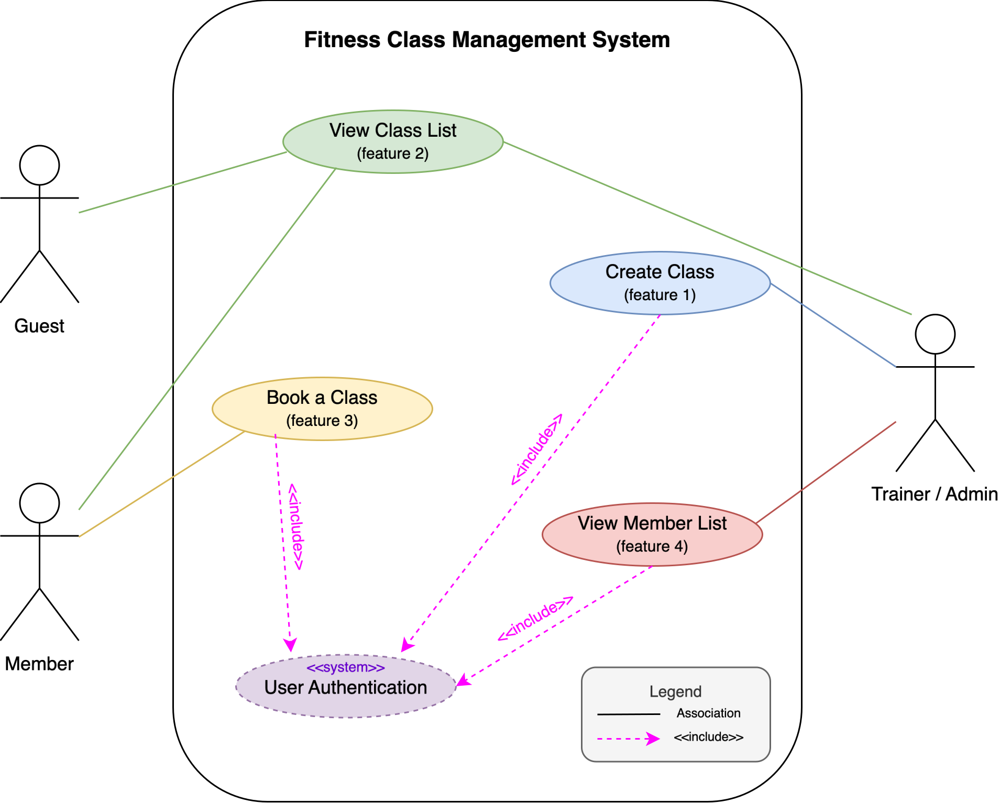

# Requirements Elicitation and Analysis

## Client Meeting (Date/Time):
We met with the client, Rania, on Thursday, Feb 12, 2026, from 2:00 PM to 2:30 PM.

## Elicitation Techniques Used: 
We used a semi-structured interview approach. Before the meeting, each team member prepared a set of planned questions for the four features (Create Class, View Class List, Book a Class, and View Member/Guest List). During the meeting, we asked follow-up questions whenever requirements were unclear or when the client introduced a new constraint. We also used our written feature descriptions and use-case prompts (e.g., “what happens when capacity is full?”) to guide the discussion and confirm edge cases.

## Reflection on Technique (Usefulness / What We’d Change):
The semi-structured interview was effective because it gave us a clear structure while still allowing flexibility to clarify requirements in real time. It helped us uncover important constraints (e.g. role permissions and capacity behavior) and confirm scope boundaries for Sprint 1. If we were to improve the process, we would bring a simple visual flow or quick use-case sketch (e.g.booking flow diagram) to confirm system behavior faster and reduce back-and-forth on edge cases.

## Important Clarification Gained
A key clarification from the meeting was the distinction between user roles and permissions. Specifically, we learned that trainers/admins can create classes, members can book classes with no booking limit, and guests can view class listings (including full classes) but cannot book without signing up/logging in. This defines who is allowed to book and what the system should do when a user does not have the required role.

After the client meeting, our team coordinated implementation through internal check-ins on Feb 13, Feb 18, and Feb 19 to align feature ownership and ensure requirements were implemented consistently across endpoints.

## Client Meeting Questions & Answers

Q: Who are the system users?

→ Guest, Member, Trainer/Admin

Q: What is the difference between roles?

 → Trainer/Admin manages classes
 
 → Member can register for classes
 
 → Guest can only view classes and must sign up/login to book
 
Q: What user details should be stored?

 → Name, email address, contact information
 
Q: What information should a class contain?

 → Name, description, start time, end time, room number, capacity
 
Q: Should users receive system feedback?

 → Yes — show success/error messages

**Feature 1 - Create Class**
Q: Who can create a class?

 → Trainer/Admin only
 
Q: How many classes can a trainer create?

 → No limit
 
Q: Who decides class capacity?

 → Trainer decides
 
Q: What happens if capacity is reached?

 → No more users can register
 
Q: Can classes overlap in time?

 → Yes (no validation required in this sprint)
 
Q: Should we validate date/time conflicts?

 → No validation required

**Feature 2 - View Class List**
Q: Who can view class listings?

 → Guests and Members
 
Q: Time range of classes shown?

 → Upcoming classes within a week
 
Q: Should full classes still be visible?

 → Yes, visible but marked closed/full
 
Q: Should filtering exist?

 → Not required in this sprint

 **Feature 3 - Book a Class**
Q: Who can book a class?

 → Members only (Guests must sign up/login first)
 
Q: Is there a limit to how many classes a member can book?

 → No limit
 
Q: Can members book overlapping classes?

 → Yes
 
Q: What happens when capacity is full?

 → Booking rejected

**Feature 4 - View Member List**
Q: Who can view booked users?

 → Trainer/Admin

Q: What information should be visible?

 → Name, email, contact

Q: Does the list need download/export?

 → Viewing only is sufficient

**Feature 5 - Send Reminder Emails**

Q: Is reminder sending automated or manually triggered by the trainer?

 → No automation is needed. The trainer/admin manually triggers the reminder at any time they choose.

Q: Who receives the reminder when it is sent?

 → All members currently enrolled in the class at the time the trainer triggers the reminder.

Q: What information must the reminder email include?

 → All class information: name, description, trainer name, date, start time, end time, and room number.

Q: Can the trainer send multiple reminders for the same class, or toggle reminders on/off per class?

 → There is no per-class toggle. The trainer can trigger the reminder endpoint as many times as needed.

Q: Is retry logic or admin notification required when an email fails to deliver?

 → No. The system should report which emails succeeded and which failed in the response, but no automated retry or notification is required.

# Use Case Diagram

# Case Specifications for each feature

## Feature 1: Create Class

**Use Case Name: Create new class**

**Precondition**

- User must be logged in as an admin

**Main Success Scenario**

1. Admin/Trainer chooses "Create Class" option
2. System displays class creation form
3. Admin/Trainer fills in all required fields:
   - Name
   - Description
   - Start Time
   - End Time
   - Capacity
   - Room Number
4. Admin/Trainer submits form
5. System validates user input
6. System creates class with all fields entered
7. System displays success message

**Alternative Flows/Extensions**

**3a. Admin leaves required fields empty:**

- 3a1. System detects missing required fields
- 3a2. System displays error message indicating which fields are required
- 3a3. Return to step 3

**5a. Admin enters an invalid input:**

- 5a1. System detects invalid input
- 5a2. System displays error message about invalid input fields
- 5a3. Return to step 3

**6a. Admin cancels the operation at any time before submission:**

- 6a1. System discards entered information
- 6a2. Use case ends

**Success Guarantee / Postconditions**

- A new fitness class is successfully created and stored in the database
- A success message is displayed
- The class is available and visible for other users to view and join
- All required information (capacity, description, start time, end time, room number) is accurately recorded

---

## Feature 2: View Class List

**User case story: As a guest/member, I want to see a list of upcoming fitness classes so I can decide what to book.**

**Use case name: View all upcoming classes**

**Preconditions**

1. The system has fitness classes stored in the database
2. User can be a member or a guest to view classlists

**Main success scenario**

1. User navigates to class listings page 
2. System retrieves all upcoming classes within the next week
3. System shows classes by start time/earliest first
4. System shows all classes in a list format with:
  a) Class name, date, time, and location
  b) Current capacity/status (Open/Closed)
  c) Short description of the class and trainer name
5. A member succesfully sees a list of classes they are already enrolled in.
6. Guest/Member successfully sees the class lists

**Alternative flows/Extensions**

A1. Class lsitings page not accessible
- A user should come in person to the facility to check for availble classes if online checks fail.
A2. No upcoming classes available
- The system shows nothing and the user sees a blank page
A3. Connection to class informations fails
- The user sees a blank page and need to refresh the page or try again later
A4. The classes miss some information
- The system shows classes as they are
A5. Enrolled classes viewing 
  a) A member with no previous class enrollment checks bookings
  - The system verifies member's identity
  - The memebr sees an empty page under enrolled classes
  b) A guest tries to see enrolled classes
  - The system checks guests identity
  - The system prompts guest to log in first
  - The guest is redirected to sign up/ log in page

**Success guarantee/Postconditions**

1. User has an accurate view of all upcoming classes in the next week
2. User can see class status either Open or Closed
3. Members see their enrolled classes
4. Guests access available classes before registering 

---

## Feature 3: Book A Class

**Use Case Name** : Book a Fitness Class

**Preconditioins**

1. The user is authenticated by the system.
2. The fitness class exists in the system.
3. The class has a defined and available capacity.

**Main Success Scenario**

1. User views available fitness classes and selects a class to book.
2. User submits a booking request for the selected class.
3. System verifies the user exists and the class exists.
4. System checks that:
   a) The user is not already booked in the class, and
   b) the class is not full (booked count < capacity)
5. System records the booking by:
   a) adding the user to the class's list of booked users, and
   b) adding the class to the user's list of booked classes.
6. System returns a confirmation that the booking was successful.

**Alternative Flows/Extensions**
A1: Class is full

- At step 4, if booked count is greater than or equal to the capacity, the system rejects the booking and informs the user the class is full.
  A2: User already booked
- At step 4, if the user is already enrolled, the system rejects the booking and informs the user they are already booked.
  A3: User not found/ not identified
- At step 3, if the user does not exist (or properly authenticated), the system rejects the request and informs the user.
  A4: Class not found
- At step 3, if the class does not exist, the system rejects the request and infroms the user.

**Success Guarantee / Postconditions**

1. The user is enrolled in the selected class
2. The class's booked user list includes the user
3. The user's booked class list includes the class
4. The class capacity is not exceeded

---

## Feature 4: View Member/Guest List of a Class

**User story: As a class trainer or center admin, I want to view who has booked a spot in my class.**

**Use case name**
View Booked Member List for a Class

**Preconditions**

1. The requester (trainer or admin) is authenticated with a valid JWT token.
2. The requester's account has the role of trainer or admin.
3. The fitness class exists in the system and has a valid class ID.

**Main Success Scenario**

1. The trainer or admin sends a request to view the member list for a specific class, providing the class ID and their JWT token.
2. The system validates the JWT token and confirms the requester's role is trainer or admin.
3. The system looks up the class by the provided class ID and confirms it exists.
4. The system retrieves the list of user IDs stored in the class's booked users list.
5. For each user ID, the system fetches the corresponding user's details: name, email address, and contact number.
6. The system returns the full list of booked members with their details to the requester.

**Alternative Flows/Extensions**
A1: Missing or invalid JWT token

- At step 2, if no token is provided or the token is invalid/expired, the system rejects the request with a 401 Unauthorized response.

A2: Insufficient role

- At step 2, if the requester's role is member (not trainer or admin), the system rejects the request with a 403 Forbidden response.

A3: Class not found

- At step 3, if the provided class ID does not match any class in the system, the system rejects the request with a 404 Not Found response.

A4: Class has no bookings

- At step 4, if the class's booked users list is empty, the system returns a 200 OK response with an empty list.

**Success Guarantee / Postconditions**

1. The trainer or admin receives a list of all members who have booked a spot in the class.
2. Each entry in the list contains the member's name, email address, and contact number.
3. No user data is modified as a result of this request.
4. Only authenticated trainers and admins can access this information; members and unauthenticated users cannot.

---

## Feature 5: Send Reminder Emails

**User story: As a fitness trainer, I want to send reminder emails to those who signed up for a class before it takes place.**

**Use Case Name:** Send Reminder Emails to Enrolled Class Members

**Preconditions**

1. The trainer is authenticated with a valid JWT token.
2. The trainer's account has the role of "trainer".
3. The fitness class exists in the system and has a valid class ID.
4. The logged-in trainer is the trainer assigned to the class.

**Main Success Scenario**

1. The trainer sends a POST request to the reminder endpoint, providing the class ID and their JWT token.
2. The system validates the JWT token and confirms the requester's role is "trainer".
3. The system verifies the logged-in trainer is the one assigned to the specified class.
4. The system looks up the class by the provided class ID and confirms it exists.
5. The system retrieves the list of all members currently enrolled in the class.
6. For each enrolled member, the system sends a reminder email via Amazon SES containing all class details: name, description, trainer name, date, start time, end time, and room number.
7. The system returns a summary response indicating how many emails were sent successfully and listing any failures.

**Alternative Flows/Extensions**

A1: Missing or invalid JWT token

- At step 2, if no token is provided or the token is invalid/expired, the system rejects the request with a 401 Unauthorized response.

A2: Insufficient role

- At step 2, if the requester's role is not "trainer", the system rejects the request with a 403 Forbidden response.

A3: Trainer not assigned to this class

- At step 3, if the logged-in trainer is not the trainer assigned to the class, the system rejects the request with a 403 Forbidden response.

A4: Class not found

- At step 4, if the provided class ID does not match any class in the system, the system rejects the request with a 404 Not Found response.

A5: No members enrolled

- At step 5, if the class has no enrolled members, the system returns a 200 OK response with an empty sent list and an appropriate message.

A6: Some emails fail to send

- At step 6, if one or more emails are rejected by SES, those failures are recorded. The system continues sending to all remaining members and includes both successes and failures in the final response.

**Success Guarantee / Postconditions**

1. A reminder email containing all class details is sent to every enrolled member.
2. The system returns a summary of successfully delivered emails and any failures.
3. No class or user data is modified as a result of this request.
4. Only the trainer assigned to the class can trigger reminder emails for that class.
